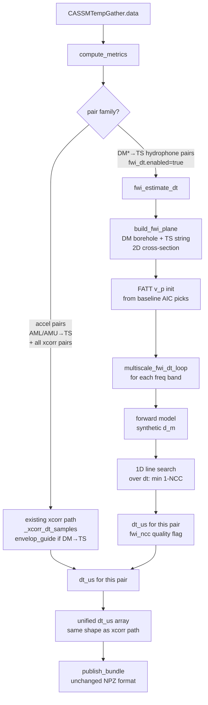

# CDD-TLFWI Integration Plan for CUSSP CASSM Pipeline

## Strategic Approach: Two Phases

### Phase 1 — Hybrid FWI dt Estimator (implement now)
Use FWI machinery as a **cycle-skip-resistant travel-time estimator** for the `DM*→TS` hydrophone pairs that are causing cycle-skip problems. All other pairs continue using the existing xcorr path. The output is still a unified `dt_us` array in the same NPZ bundle — no changes to downstream plotting, dashboards, or the TTCR inversion chain.

This slots directly into the existing per-pair-family dispatch already present in [`compute_metrics()`](../scripts/python/vm/cussp_cassm_process.py:1088), alongside the `envelope_guide_xcorr` logic.

### Phase 2 — Full CDD-TLFWI δv_p Mode (future)
Run the complete CDD-TLFWI methodology as described in the paper: full wave-equation forward modelling → correlative misfit → adjoint gradient → `δv_p(x,z)` spatial model per epoch. This is a separate run mode, produces different output types, and replaces the TTCR inversion chain. Designed in this document but not implemented until Phase 1 is validated.

---

## Phase 1 Design

### Concept

The current `envelope_guide_xcorr` approach (Hilbert envelope coarse lag → waveform fine xcorr) is already the right idea but still operates purely in the signal-processing domain. It can still cycle-skip when the envelope estimate is noisy.

The FWI dt estimator replaces this with a **model-based approach** for `DM*→TS` pairs:

1. Build a 2D velocity model `v_p(x,z)` for the DM-borehole → TS-string vertical cross-section from FATT (first-arrival traveltime tomography using existing AIC picks)
2. For each epoch, simulate the wavefield forward through this model
3. Find the time shift `dt` that minimizes the **correlative misfit** (1 − NCC) between the synthetic and observed waveforms — this is a 1D line search over `dt`, not a full gradient inversion
4. That `dt` value is the FWI-derived `dt_us` for that pair-epoch, substituting the xcorr lag

The key property: the correlative misfit `1 − NCC` has a **broader basin of attraction** than the xcorr peak-picking approach because it penalizes phase misalignment globally across the window rather than hunting for the sharpest local correlation peak. Combined with the multiscale frequency strategy (coarse band establishes the approximate shift; fine band refines it), this avoids locking onto the wrong cycle.

### What Changes vs What Stays The Same

| Component | Phase 1 change |
|---|---|
| `scan_new_epochs()` | None — data ingest unchanged |
| `CASSMTempGather` | None — waveform storage unchanged |
| `_baseline_picks()` | None — AIC picks reused for FATT |
| `compute_metrics()` | New branch for `DM*→TS` pairs: call `fwi_estimate_dt()` instead of `_xcorr_dt_samples()` |
| `rms`, `centfreq`, `spec_ratio_slope` | Still computed from the same windowed epoch segment, unchanged |
| `xcorr_peak_cc`, `xcorr_edge_hit` | Replaced with `fwi_ncc` (same semantic: quality metric for the dt estimate) |
| `publish_bundle()` | Unchanged — still writes `dt_us`, `rms`, `centfreq` etc. |
| All QC plots | Unchanged |
| TTCR inversion | Unchanged — consumes `dt_us` as before |
| YAML config | New `fwi_dt:` section added under `xcorr:` |

---

## File Layout

```
python/vm/
├── cussp_cassm_process.py     # EXISTING — minor addition in compute_metrics() dispatch
├── cussp_cassm_fwi.py         # NEW — FWI dt estimator (Phase 1) + stubs for Phase 2
└── cussp_cassm_config.yaml    # EXISTING — new fwi_dt: section added under xcorr:
```

No new standalone config file needed for Phase 1 — the FWI parameters live inside the existing `xcorr:` section.

---

## Phase 1 Workflow



---

## New Module: `cussp_cassm_fwi.py` — Phase 1 Contents

### `FWIGrid` dataclass

```python
@dataclass
class FWIGrid:
    """2D vertical cross-section grid for FD wave equation solver."""
    nx: int          # horizontal samples
    nz: int          # vertical (depth) samples
    dx: float        # horizontal spacing (m)
    dz: float        # vertical spacing (m)
    x0: float        # origin x (HMC easting, m)
    z0: float        # origin z (HMC depth, m, negative = below surface)
    dt: float        # time step (s) — CFL-constrained
    nt: int          # number of time steps
    # Derived coordinate arrays
    x: np.ndarray    # shape (nx,)
    z: np.ndarray    # shape (nz,)

    @classmethod
    def from_source_receiver_positions(
        cls,
        src_positions: np.ndarray,    # (n_src, 3) x,y,z in HMC m
        rec_positions: np.ndarray,    # (n_rec, 3) x,y,z in HMC m
        dx: float,
        dz: float,
        dt: Optional[float],         # None = auto CFL
        vp_max_estimate: float,      # for CFL calc, m/s
        padding_m: float = 20.0,     # grid padding beyond src/rec extent
    ) -> "FWIGrid": ...
```

The 2D plane is defined as a vertical section containing the DM source borehole and the TS receiver string. Since both are approximately vertical (depths vary, lateral separation fixed), the plane is parameterized by depth `z` and horizontal distance along the inter-borehole axis `x`.

### `SolverBackend` protocol

```python
class SolverBackend(Protocol):
    def forward(
        self,
        vp: np.ndarray,               # 2D (nz, nx) m/s
        source_wavelet: np.ndarray,   # 1D (nt,) normalized
        source_pos_grid: Tuple[int, int],   # (iz, ix) grid indices
        receiver_pos_grid: np.ndarray,      # (n_rec, 2) grid indices
    ) -> np.ndarray:                  # (n_rec, nt) synthetic seismograms
        ...
```

Three implementations (all in `cussp_cassm_fwi.py`):

#### `AnalyticSolver`
- Computes straight-ray traveltime `t = distance / v_mean` from source to each receiver
- Convolves a Ricker wavelet shifted by `t` with amplitude `1/r`
- **No geometry**: ignores grid entirely, uses only `v_p` mean
- Purpose: end-to-end pipeline testing without any real physics
- Zero additional dependencies

#### `FD2DSolver`
- Standard O(2,2) explicit finite-difference acoustic wave equation
- `∂²u/∂t² = v_p²(x,z) [∂²u/∂x² + ∂²u/∂z²] + s(t)δ(x-xs,z-zs)`
- CPML absorbing boundaries on all four edges (prevents wrap-around reflections)
- Vectorized over receivers: one forward per source, extract at all receiver positions
- Adjoint state: reversed-time propagation of the residual field
- All numpy/scipy, no extra deps
- Grid spacing constraint: `dx ≤ v_min / (10 × f_max)` for adequate sampling

#### `DevitoSolver` (optional import)
- Thin wrapper around Devito's acoustic forward/adjoint operators
- Only imported if `devito` is installed; falls back to `FD2DSolver` otherwise
- GPU-capable via Devito's OpenMP/CUDA backends

### `build_fwi_plane()`

```python
def build_fwi_plane(
    tg: CASSMTempGather,
    src_indices: np.ndarray,     # which source indices are DM* (0-based)
    rec_indices: np.ndarray,     # which receiver indices are TS hydrophones (48-71)
    sources_csv: Path,
    receivers_csv: Path,
    fwi_config,                  # namespace from yaml fwi_dt: section
) -> Tuple[FWIGrid, np.ndarray, np.ndarray]:
    """Load source/receiver coordinates, construct 2D grid in the DM-TS vertical plane.
    Returns (grid, src_positions_grid, rec_positions_grid) where positions are
    (iz, ix) integer grid indices for each source/receiver."""
```

### `estimate_source_wavelet()`

```python
def estimate_source_wavelet(
    d_obs_baseline: np.ndarray,   # (n_pairs, nt) observed baseline waveforms
    baseline_picks: np.ndarray,   # (n_pairs,) sample indices from _baseline_picks()
    gate_pre_samples: int,
    gate_post_samples: int,
    src_indices: np.ndarray,
    rec_indices: np.ndarray,
    n_receivers: int,
) -> np.ndarray:
    """Per-source wavelet from paper: window first-arrival direct wave, sum over receivers.
    Returns (n_dm_sources, nt) array of estimated source wavelets."""
```

### `build_initial_vp()`

```python
def build_initial_vp(
    grid: FWIGrid,
    src_positions_grid: np.ndarray,   # (n_src, 2) iz,ix
    rec_positions_grid: np.ndarray,   # (n_rec, 2) iz,ix
    baseline_picks: np.ndarray,       # (n_pairs,) samples — subset for DM*→TS pairs
    sample_rate_hz: float,
    vp_background: float = 3000.0,    # m/s starting uniform model
) -> np.ndarray:
    """FATT: straight-ray back-projection of traveltime residuals onto 2D grid.
    Returns v_p (nz, nx) array. Falls back to uniform background if picks are
    sparse or traveltime residuals are too noisy to constrain the model."""
```

### `fwi_estimate_dt()`

This is the key Phase 1 function — the drop-in replacement for `_xcorr_dt_samples()` for `DM*→TS` pairs:

```python
def fwi_estimate_dt(
    bl_win: np.ndarray,          # baseline waveform window (n_samples,) — preprocessed + tapered
    ep_win: np.ndarray,          # epoch waveform window (n_samples,)
    vp: np.ndarray,              # 2D velocity model (nz, nx)
    grid: FWIGrid,
    source_wavelet: np.ndarray,  # (nt,) estimated source wavelet
    src_pos_grid: Tuple[int, int],
    rec_pos_grid: Tuple[int, int],
    solver: SolverBackend,
    freq_bands: List[Tuple[float, float]],  # e.g. [(250,2000),(500,8000),(1000,20000)]
    sample_rate_hz: float,
    dt_search_max_s: float = 0.002,   # ±2 ms search range
    dt_search_step_s: float = 1e-6,   # 1 µs resolution
    min_ncc: float = 0.2,
) -> Tuple[float, float, bool]:
    """FWI-derived travel-time shift estimate for one source-receiver pair.

    Algorithm (per frequency band, coarse to fine):
      1. Bandpass bl_win, ep_win, and synthetic d_m to current band
      2. Forward model: compute d_m through current v_p
      3. 1D line search: find dt* = argmin_dt (1 - NCC(d_m(t+dt), ep_win))
         over ±dt_search_max_s in dt_search_step_s increments
         (parabolic sub-sample refinement around the minimum)
      4. The dt_search range narrows each band (coarse band anchors fine band)

    Returns (dt_us, peak_ncc, rejected) — same signature as _xcorr_dt_samples()
    so the caller in compute_metrics() requires no structural changes."""
```

**Why a 1D line search instead of full gradient inversion?**
Phase 1 does not update `v_p` — it uses a fixed baseline velocity model and simply finds the time shift `dt` that makes the synthetic most like the observed waveform. This is equivalent to the correlative FWI misfit evaluated at the correct `v_p`, but solving for `dt` directly (1D parameter) rather than `v_p` (grid-sized parameter). It's much cheaper, produces a `dt_us` scalar directly, and lets us validate the approach before investing in full gradient inversion.

The velocity model is updated once per processing run from the baseline data (FATT), not per epoch — `v_p` is treated as the background model and `dt` as the time-lapse observable.

### `multiscale_fwi_dt_loop()`

```python
def multiscale_fwi_dt_loop(
    bl_win: np.ndarray,
    ep_win: np.ndarray,
    vp: np.ndarray,
    grid: FWIGrid,
    source_wavelet: np.ndarray,
    src_pos_grid: Tuple[int, int],
    rec_pos_grid: Tuple[int, int],
    solver: SolverBackend,
    freq_bands: List[Tuple[float, float]],
    sample_rate_hz: float,
    dt_search_max_s: float,
) -> Tuple[float, float]:
    """Run FWI dt line search across frequency bands coarse-to-fine.
    Each band narrows the search window around the coarse-band result.
    Returns (dt_us, best_ncc)."""
```

Per band:
1. Bandpass `bl_win`, `ep_win`, and source wavelet to `[f_low, f_high]`
2. Run `solver.forward()` with bandpassed wavelet → `d_m`
3. Line search over `dt` in `±dt_search_max_s`: compute `NCC(d_m(t+dt), ep_win_band)` for each candidate `dt`
4. Parabolic sub-sample refinement around the NCC maximum
5. Narrow `dt_search_max_s` for next band to ± half-period at `f_low`

---

## `compute_metrics()` Dispatch Change

Inside the existing `xcorr` branch of [`compute_metrics()`](../scripts/python/vm/cussp_cassm_process.py:1030), the per-epoch inner loop currently has:

```python
if _use_envelope_this_pair:
    # two-stage envelope xcorr
    ...
else:
    lag, peak_cc, edge_hit = _xcorr_dt_samples(...)
```

Phase 1 adds a third branch, checked first:

```python
if _use_fwi_dt_this_pair:
    # FWI-derived dt — imported from cussp_cassm_fwi
    lag_us, fwi_ncc, rejected = fwi_estimate_dt(...)
    lag = lag_us / (tg.dt * 1e6)   # convert back to samples for acceptance gate
    peak_cc = fwi_ncc
    edge_hit = rejected
elif _use_envelope_this_pair:
    ...
else:
    ...
```

`_use_fwi_dt_this_pair` is True when:
- `config.fwi_dt_enabled` is True (new config flag)
- `_is_dm_source` is True (source borehole starts with "DM")
- `_is_hydro` is True (receiver index ≥ 48, TS hydrophones)

This mirrors exactly the existing `_use_envelope_this_pair` condition.

The FWI grid and velocity model are built **once before the pair loop** and reused for all `DM*→TS` pairs. The source wavelet is estimated per source borehole (one wavelet for DML sources, one for DMU sources).

---

## Config Changes — Phase 1

Add a `fwi_dt:` section inside `xcorr:` in `cussp_cassm_config.yaml`:

```yaml
xcorr:
  # ... existing xcorr settings unchanged ...

  # ---------------------------------------------------------------------------
  # FWI-DERIVED DT FOR DM*→TS HYDROPHONE PAIRS (cycle-skip resistant)
  # ---------------------------------------------------------------------------
  # When enabled, replaces xcorr/envelope dt estimation for DM*→TS pairs with
  # a wave-equation forward model + correlative misfit 1D line search.
  # All other pairs continue using xcorr/envelope as configured above.
  fwi_dt:
    enabled: false   # set true to activate for DM*→TS pairs

    # Coordinate files for source/receiver positions (HMC frame, metres)
    # Same CSVs used by cussp_cassm_inversion_prep.py
    sources_csv: /home/chopp/cassm_local/inversion/input/sources_hmc.csv
    receivers_csv: /home/chopp/cassm_local/inversion/input/receivers_hmc.csv

    # Wave equation solver backend
    # "analytic" — straight-ray + Ricker wavelet (fast, for testing)
    # "fd2d"     — 2D finite-difference acoustic (no extra deps, recommended)
    # "devito"   — Devito-based (requires devito package, GPU-capable)
    solver: fd2d

    # 2D grid spacing (m). Constraint: dx <= v_min / (10 * f_max_band)
    # At 250-2000 Hz and v_min~2000 m/s: dx <= 0.1 m (coarse band governs)
    grid_dx_m: 0.5
    grid_dz_m: 0.5

    # Grid padding beyond source/receiver extent (m)
    grid_padding_m: 20.0

    # Background v_p for FATT initialisation (m/s)
    vp_background_mps: 3000.0

    # Multiscale frequency bands [f_low, f_high] Hz, coarse to fine.
    # Must cover your usable signal band. Coarse band sets cycle-skip floor.
    # Coarse band: f_low < 1/(2*max_expected_lag). For 1.5 ms max lag: f_low < 333 Hz.
    freq_bands:
      - [250, 2000]
      - [500, 8000]
      - [1000, 20000]

    # Initial dt search range (ms) for the coarsest band. Narrowed automatically
    # each subsequent band to ±half-period at that band's f_low.
    dt_search_max_ms: 2.0

    # Minimum NCC to accept an FWI-derived dt (analogous to xcorr.min_peak_cc)
    min_ncc: 0.2

    # P-wave gate for FWI line search (ms). Reuses preprocessing.window_pre_pick_ms
    # and window_post_pick_ms when null.
    gate_pre_ms: null
    gate_post_ms: null
```

---

## Phase 2 Design (Deferred — Architecture Only)

Phase 2 replaces the concept of per-pair `dt_us` entirely for a selected run mode. The YAML selector becomes:

```yaml
method: xcorr   # existing path (default)
# method: fwi   # full CDD-TLFWI — produces δv_p(x,z) per epoch, not dt_us
```

Phase 2 additions to `cussp_cassm_fwi.py`:

### `build_observed_baseline()` — average first N epoch cubes → `d_obs_baseline (n_pairs, nt)`

### `build_pseudo_monitoring_data()` — Eq. 2
```
δd = d_obs_epoch - d_obs_baseline
w = max|d_obs_baseline| / max|d_m_baseline|  (per source, amplitude scaling)
d_pm = w × d_m_baseline + δd
```

### `correlative_misfit()` — Eq. 1 integrated over all pairs
```
f = Σ_pairs (1 - NCC(d_m, d_pm))
adjoint_source[pair] = (d_pm_norm - NCC * d_m_norm) / (||d_m|| × ||d_pm||)
```

### `multiscale_fwi_loop()` — full gradient inversion
For each frequency band × iteration:
1. Bandpass all data
2. Forward model all sources → `d_m`
3. Construct `d_pm` per epoch
4. `correlative_misfit()` → misfit scalar + adjoint sources
5. Adjoint model → gradient `∂f/∂v_p` on grid
6. Gradient precondition (diagonal Hessian approximation)
7. Update `v_p` ← `v_p - step_length × gradient`

### `publish_fwi_bundle()` — separate from `publish_bundle()`
Bundle keys: `vp_baseline`, `delta_vp (n_epochs, nz, nx)`, `misfit_history`, `per_pair_ncc`, `grid_x`, `grid_z`, `epoch_labels`, `epoch_times`

### `write_fwi_qc()` — separate from `write_processing_qc()`
- `fwi_misfit_convergence.png` — per-band misfit vs iteration
- `fwi_vp_baseline.png` — 2D baseline velocity heatmap
- `fwi_delta_vp_epoch_N.png` — velocity perturbation at key epochs
- `fwi_ncc_heatmap.png` — per-pair NCC over epochs
- `fwi_summary.json`

---

## Implementation Sequence (Phase 1)


Phase 1 does **not** require the adjoint FD solver — only the forward model is needed for the 1D line search. The adjoint is deferred to Phase 2.
